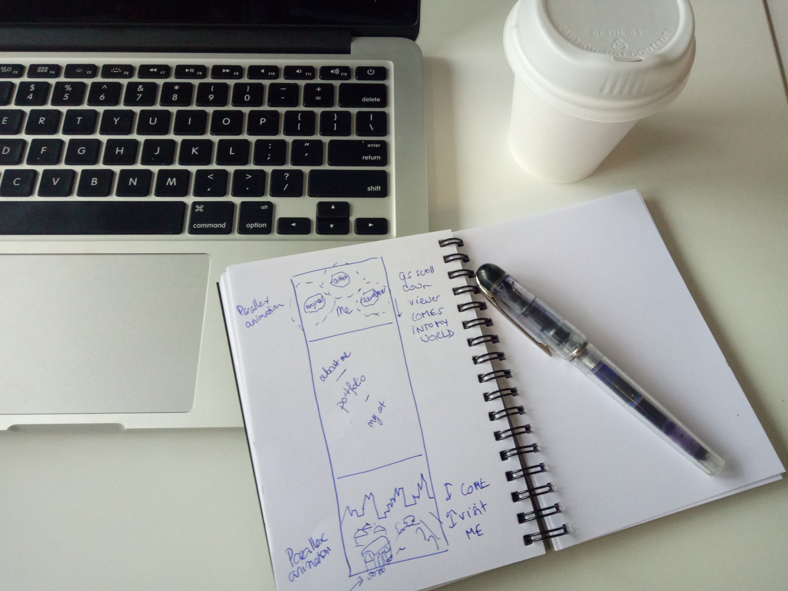
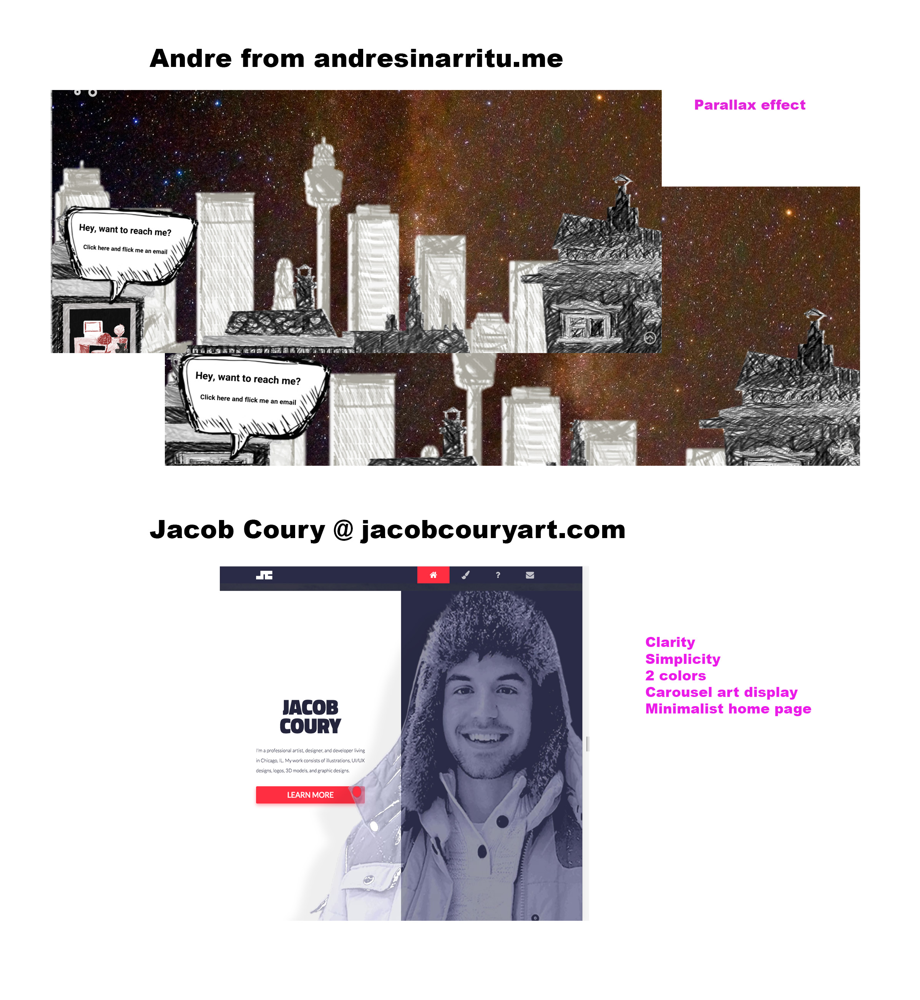
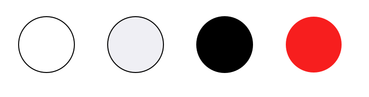
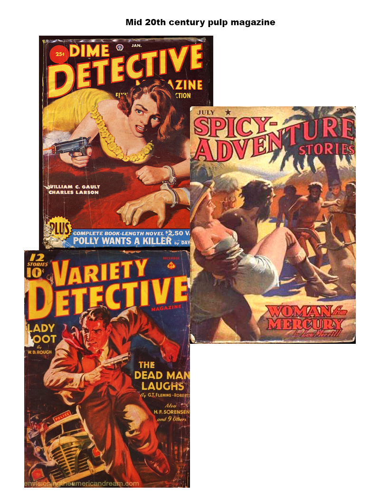
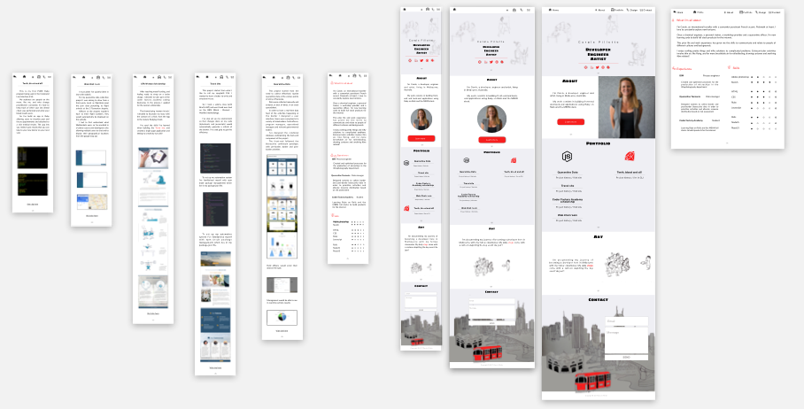

# CONTENT
I wanted to create a site with 3 main parts:
1. Showing my multiple facets in the hero banner (developer, engineer and artist), and have an animation (in the form of parallax) to invite the viewer to COME INTO MY WORLD (transform-translate and transform-scale).

2. Displaying information about:
* me (a short paragraph about me, my prior professional experience and my skills)
* my portfolio (with an emphasis on being a **dual** stack developer, with *Ruby on Rails* and *MEAN* projects), and finally
* my art and community engagement
THUS SHOWING THE VIEWER WHAT MY WORLD IS ABOUT

3. Inviting the viewer to contact me in this beautiful city of Melbourne. The use of parallax sets the scene in motion; adding the movement of the tram incites the viewer to TAKE THE JOURNEY AND JOIN ME.

# INSPIRATION
Given that the above narrative is the keystone of my website, I wanted to keep sections clean, simple and articulated. Therefore they each have a neutral palette tone, yet with a 'red' element in each (to keep the flow and articulate each part with one another). I've also included my own art work to personalise my website.

## Other websites and art work
I was inspired by two developers. Firstly, Andre Sinarritu from [andresinarritu.me] (http://andresinarritu.me) and his parallax effects, particularly at the bottom of his page.

I was also inspired by Jacob Coury from [jacobcouryart.com] (http://www.jacobcouryart.com/) with this clean and clear display.

## Colour palette

I opted for a minimalist set of colour. I was inspired by the red of the free inner city trams of Melbourne. Given that I'm studying ruby, it made sense to adopt red all along the website.

To balance the red I chose a blue-ish grey.

## Font-family

I've selected 3 different font-family for this site.

1. Most of the text is using the **Lato** font family. I find the lato font to be of classical proportions, elegant and harmonious. It has semi-rounded details in its letters bringing a feeling of warmth. It also has a strong structure providing stability and seriousness.

2. The font I've used for my main titles is **Sigmar One**. It is a fun font, inspired by mid-twentieth century pulp magazine advertising.

3. Finally I've selected the **Hiragino Sans** font for the sub-titles. Hiragino was created in Japan for the kana typeface and used to produce the 7000 glyphs! Glyphs which remind me in some ways of my little cartoons. The 'sans' version of the font was designed in China by a top female designer: Ms. Zhong!

# Wireframes

# TECHNICAL CHALLENGES
I've opted to use Rails5 and deploy my app on heroku, for 2 reasons:
1. To practice Rails5
2. To cater for my multiple page application. The main home page contains links that direct the user to other pages (portfolio projects, more about me...)

* Created a form using formspree.io
* Added robots.txt and sitemap.xml in Ruby using documentation and SitemapGenerator gem
* Make the site responsive for large, medium and small devices, which different configurations for each - and not just one being proportionally smaller or larger than the others
* Used flex box to cater for configuration changes between iPad and desktop formats.
* Created a set of routes to direct user to numerous pages in rails
* Used parallax in the hero banner and the footer to engage the viewer to 'enter' the site and to 'come' and contact me when reaching the end of the webpage.
* Made a carousel with my drawings
* Organized main sass files into multiple sass files and imported them into the main sass file.
* Used js to smooth scroll between sections
* Used js to render red icon in navbar when section is matched to active icon
* Deployed on heroku and changed app name

# FUTURE IMPROVEMENT
* Verify cross-browser compatibility (Safari, IE, Mozilla, Google)
* Use lazyload to optimize loading speed of the website
* Use sprite to bundle all svgs into one file to optimize loading speed of the website
* Use parallax at the bottom of my site to animate tram, foreground, background
* Improve SEO for increasing chances to be found on the net
